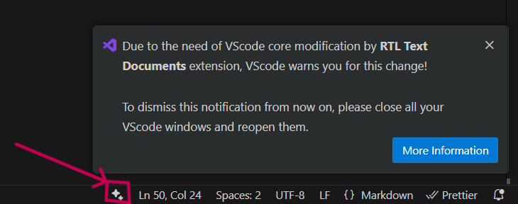

# RTL Text Documents Extension for VSCode

## Overview

The **RTL Text Documents** extension enhances VSCode's support for right-to-left (RTL) languages like Persian and Arabic. By injecting custom CSS and JavaScript into the core of VSCode (via the dependent extension [alirezakay.vscode-custom-css-silent](https://marketplace.visualstudio.com/items?itemName=alirezakay.vscode-custom-css-silent)), this extension provides a more convenient environment for working with RTL-based text documents.

> **Note**: This extension modifies core VSCode files, which may raise integrity warnings. Use it at your own discretion.

---

## Improvements

There can be still way more improvements to this extension, that can be implemented in the near future by your help! YES, you've just heard it right. You can help by going to the github repo and pull requests or open issues.

- The option for making all files become rtl-supported (not just those with `rtl` prefix)
- The option for having the ability of not changing the vscode `wordWrap` settings field (having unlimited horizontal scroll)
- The ability for the integrity check to be disabled without the need of closing and re-opening all vscode windows (this one needs finding and manipulating more APIs of vsocde code-bases)

Current version of this extension has been the most stable and easy-to-use version of RTL support as VScode **does not** provide any good API for developers! It sucks I know! It's been more than 6 years that they know about this RTL-thing issues and they did nothing for it! Literally NOTHING!

So if this is the case, we ain't gonna sit and pray for changes from them!!! Let's make VScode great for all people. I need your support for this task 🙂

---

## Features

1. **RTL Support**:
   - Applies only to files with `rtl` in the filename before the extension (e.g., `example.rtl.txt`).
   - Automatically adjusts:
     - `editor.fontFamily` to:
       ```
       "unikode, Consolas, 'Courier New', monospace"
       ```
     - `editor.wordWrap` to `on` for improved readability.

2. **Seamless Integration**:
   - Automatically reloads the VSCode window after installation and enables RTL settings immediately.
   - Customized notification system alerts you about core file changes.

3. **Easy Control**:
   - Enable or disable the extension via:
     - Command Palette (`Disable RTL Text Documents`).
     - Extension manager in VSCode.

4. **Dependency Management**:
   - Requires the installation of [alirezakay.vscode-custom-css-silent](https://marketplace.visualstudio.com/items?itemName=alirezakay.vscode-custom-css-silent). If not installed, you will be prompted with an error message.

---

## Installation & Setup

1. Install the [alirezakay.vscode-custom-css-silent](https://marketplace.visualstudio.com/items?itemName=alirezakay.vscode-custom-css-silent) extension. Note that this is the forked version of the original `vscode-custom-css` extension. So be aware to install the correct one!
2. Install the **RTL Text Documents** extension.
3. Restart or reload your VSCode window to apply changes.
4. For additional VSCode windows, reload them manually to enable RTL support.

After installing/enabling, this extension will inject a ***sparkle icon*** at the bottom bar of vscode windows. So if you see it, it mean so far so good! It's been enabled successfully. Also after uninstalling/disabling, it'll disappear again.



---

## Notifications & Warnings

- After enabling the extension, you will see a notification about core file changes.
- To disable future warnings:
  1. Close **all** VSCode windows.
  2. Re-open VSCode to restore the file integrity checksum.

> **Important**: Modifying VSCode core files may impact its security or stability. Proceed with caution.

---

## Commands

Access these commands from the Command Palette:

- **Disable RTL Text Documents**: Deactivates the extension.
- **Enable RTL Text Documents**: Reactivates the extension if previously disabled.
- **Re-initialize RTL Text Documents**: Reloads the extension and reapplies settings.

Whenever you had problems with the extension to be taken effect, just use the re-initialize command and then reload all windows. It'll most likely make everything all right again!

Otherwise, do not worry! If things went wrong, just **RE-INSTALL** the vscode itself; close all vscode windows, run the vscode installation program and proceed the process to reinstall it. This will fix the vscode core just like it was at first!

---

## Uninstallation
- Disable or uninstall via the Extensions view in VSCode.
- Alternatively, use the commands provided by the `alirezakay.vscode-custom-css-silent` extension to manage injected files.


### IMPORTANT NOTE

**If you want to restore the default vscode core, you have to `disable` this extension using the command palette: 'Disable RTL Text Documents' and then uninstall/disable it!**

You may **close all vscode windows and re-open them** after uninstalling/disabling the extension so as to the integrity warning alert to disappear!

---

## License
This extension is open-source and available on [GitHub](https://github.com/alirezakay/vscode-rtl-text-documents).

For any issues, feel free to open an issue or contribute!

